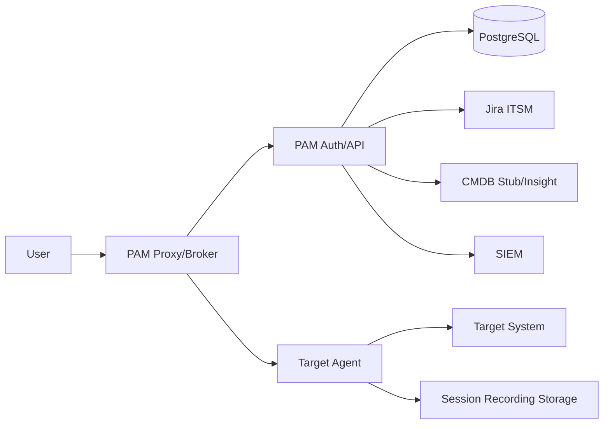

# HLD: PAM‑шлюз (Teleport‑подобная архитектура)

## 1. Цели и границы
- Контролируемый доступ к системам через единый шлюз и прокси‑уровень.
- Разделение control plane и data plane по аналогии с Teleport.
- Поддержка JIT, RBAC, аудита и записи сессий.
- MVP: критичные системы, AD, терминальные фермы.
- CMDB Insight временно заменена заглушкой.

## 2. Модель Teleport и соответствие в нашем проекте
- **Teleport Auth Service** → `PamGateway.Api` (роль/политики/заявки/аудит).
- **Teleport Proxy Service** → Session Broker (планируемый) + API вход.
- **Teleport Agents** → агенты на целевых системах (планируемые).
- **Session Recording** → подсистема записи, режимы `node|proxy`, `sync|async`.
- **Audit Events** → `AuditController` + хранилище событий.

## 3. Ключевые компоненты
- **Auth/API**: управление доступами, заявками, политиками и аудитом.
- **Session Broker**: прокси‑трафик RDP/SSH (в плане).
- **Agents**: прокси‑агенты рядом с целями (в плане).
- **Recording Storage**: хранение записей (локально/объектное).
- **Integrations**: Jira ITSM, CMDB (Stub/Insight).
- **Storage**: PostgreSQL (заявки, сессии, аудит, политики).

## 4. Логическая архитектура

## 5. Основные потоки
### 5.1 Аутентификация и авторизация
1) Пользователь входит через Proxy/API.
2) Auth выдает токен/сертификат с ролями.
3) Proxy/Agent проверяют роли и TTL.

### 5.2 JIT доступ (Access Request)
1) Запрос доступа на систему.
2) Одобрение (ITSM/Reviewer).
3) Выдача краткоживущего доступа.
4) Авто‑отзыв по истечении TTL.

### 5.3 Сессия и запись
1) Proxy/Broker инициирует сессию через Agent.
2) Запись в режимах `node|proxy`, `sync|async`.
3) Метаданные сессии фиксируются в Audit.

## 6. Нефункциональные требования
- Доступность control plane: 99.9% (MVP).
- Надежность записи: строгий режим для критичных систем.
- Единый аудит с экспортом в SIEM.

## 7. Безопасность
- MFA (когда включен Keycloak).
- Запрет прямых доступов в обход Proxy/Agent.
- Политика least privilege (allow/deny, метки ресурсов).

## 8. Артефакты
- Реестр систем MVP: `mvp_scope.md`.
- Политики RBAC/JIT/JEA: `access_policies.md`.
- HLD/SLD и backlog Teleport‑подобной реализации.
