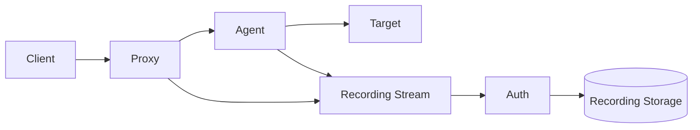

# Архитектура записи сессий (Teleport‑подобные режимы)

## 1. Режимы записи
- **node-sync**: запись на агенте, синхронная доставка в Auth/Storage.
- **node**: запись на агенте, асинхронная выгрузка после завершения.
- **proxy-sync**: запись на Proxy, синхронная доставка.
- **proxy**: запись на Proxy, асинхронная выгрузка.

## 2. Что записывается
- SSH: PTY output (команды/вывод).
- RDP: экранный поток + действия мыши.
- Метаданные: кто/куда/когда/TTL/результат.

## 3. Потоки данных


## 4. Синхронная запись
- Каждый chunk отправляется сразу.
- При ошибке записи — сессия завершится.
- Подходит для регуляторных требований.

## 5. Асинхронная запись
- Запись локально, выгрузка после окончания.
- Сессия продолжается при временной недоступности Auth/Storage.
- Требует контроля диска и retry‑механизма.

## 6. Хранилище
- Локальный FS (dev/demo).
- S3/MinIO (prod).
- Метаданные в Postgres.

## 7. Шифрование
- Поддержка at‑rest encryption.
- Ключи в KMS/HSM (опционально).

## 8. Конфигурация (пример)
```yaml
sessionRecording:
  mode: node-sync
  encryption: true
  storage: s3
```
