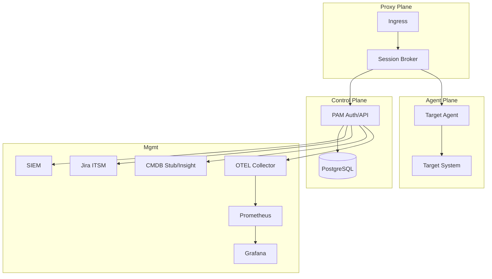
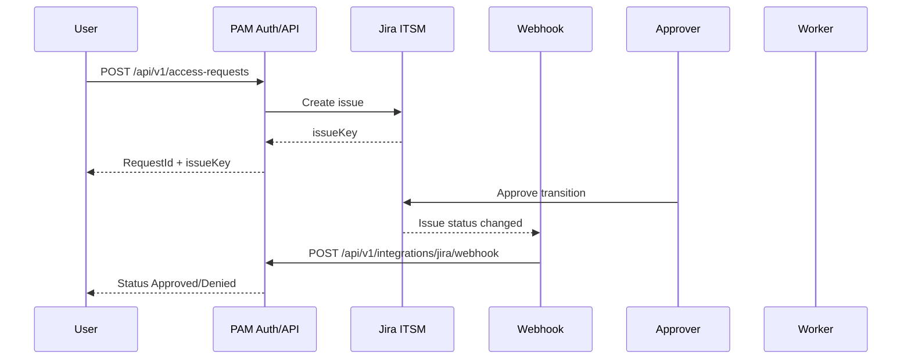

# SLD: целевая архитектура (детализация)

## 1. Сервисы и зоны
- **Control Plane**: Auth/API (PAM), PostgreSQL, Audit/Event storage.
- **Proxy Plane**: Session Broker/Proxy (в плане), Ingress.
- **Agent Plane**: агенты на целевых системах (в плане).
- **Mgmt**: SIEM, мониторинг (OTEL/Prometheus/Grafana).

## 2. Сетевые взаимодействия (минимум)
- User → Proxy/API: HTTPS 443.
- Proxy/API → Auth: HTTPS/gRPC (внутренний).
- Proxy → Agent: mTLS/WebSocket (туннель).
- Agent → Target: SSH 22, RDP 3389, HTTPS 443.
- Auth → PostgreSQL: TCP 5432.
- Auth → SIEM: HTTPS/syslog.
- Auth → ITSM/CMDB: HTTPS.
- OTEL Collector → Prometheus: HTTP 9464.
- Grafana → Prometheus: HTTP 9090.

## 3. Диаграмма развертывания

## 4. Контракты между компонентами
- **Auth ↔ Proxy**: выдача session tickets, RBAC, TTL.
- **Proxy ↔ Agent**: создание/завершение сессии, канал трафика.
- **Agent ↔ Auth**: heartbeat, audit, запись/метаданные.

## 5. Масштабирование и HA
- Auth/API: горизонтальное масштабирование + shared DB.
- Proxy/Broker: active‑active, sticky‑sessions по session ID.
- Agent: локальный процесс у цели.
- Recording storage: S3/MinIO для прод, локально для dev.
- Minikube: probes включены для API/UI/Worker, Keycloak probes отключены.

## 6. Конфигурация (MVP)
- `Auth.Enabled`: false (Minikube), true (prod).
- `Cmdb.Provider`: Stub (dev), Insight (prod).
- `SessionRecording.Mode`: node/proxy + sync/async (в плане).
- `Observability.Enabled`: true (Minikube), OTLP → OTEL Collector.
- `ObservabilityStack.Enabled`: true (Minikube) для Prometheus/Grafana.

## 7. Sequence: Access Request / Approval

